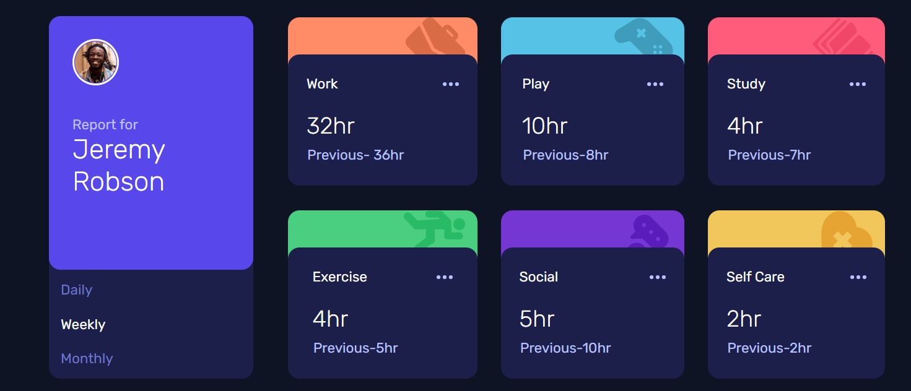

# Frontend Mentor - Time tracking dashboard solution

This is a solution to the [Time tracking dashboard challenge on Frontend Mentor](https://www.frontendmentor.io/challenges/time-tracking-dashboard-UIQ7167Jw). Frontend Mentor challenges help you improve your coding skills by building realistic projects. 

## Table of contents

- [Overview](#overview)
  - [The challenge](#the-challenge)
  - [Screenshot](#screenshot)
- [My process](#my-process)
  - [Built with](#built-with)
  - [What I learned](#what-i-learned)
  - [Continued development](#continued-development)
  - [Useful resources](#useful-resources)
- [Author](#author)

## Overview

### The challenge

Users should be able to:

- View the optimal layout for the site depending on their device's screen size
- See hover states for all interactive elements on the page
- Switch between viewing Daily, Weekly, and Monthly stats

### Screenshot



## My process

### Built with

- Semantic HTML5 markup
- CSS custom properties
- Flexbox
- CSS Grid
- Mobile-first workflow
- JavaScript
- [Styled Components](https://styled-components.com/) - For styles

### What I learned
I learned how to display JSON data on an HTML page using JavaScript and how to add and delete classes on click.
To see how you can add code snippets, see below:

```css
.active {
  color: var(--paleBlue-title);
}
```
```js

fetch(file) 
.then(response =>  {
    return response.json();
})
.then(json => {
    displayData(json);
})
.catch(err => {
    console.log("Error: " + err);
});

```

### Continued development

I will focus more on working with JSON data because I had some problems with accessing it and you can see that my code is pretty beginner worthy so I need to focus more on how to make it more ridable and not so much convoluted.


### Useful resources

- [Example resource 1](https://howtocreateapps.com/fetch-and-display-json-html-javascript/) -This source helped me with displaying and accessing JSON data.
- [Example resource 2](https://stackoverflow.com/questions/7077673/add-and-remove-class-on-click) - TThis source helped me with adding an active class on a element and removing it when clicking another a element.


## Author

- Website - [Djordje Rajc]
- Frontend Mentor - [@Blurryface1998](https://www.frontendmentor.io/profile/Blurryface1998)
- Twitter - [@Blurryface_1998](https://twitter.com/Blurryface_1998)